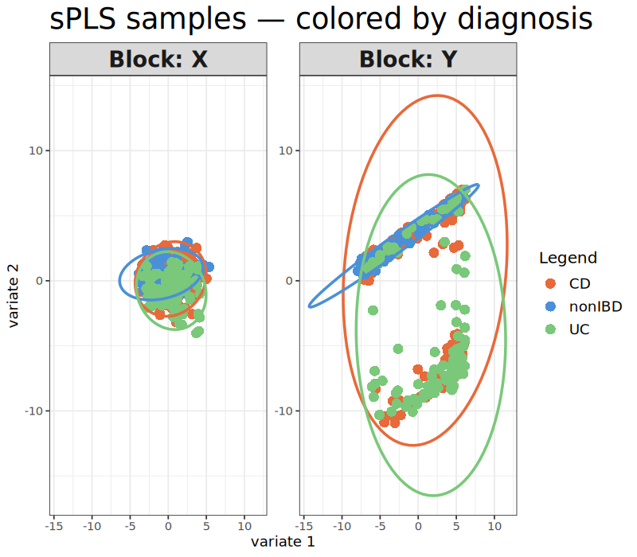
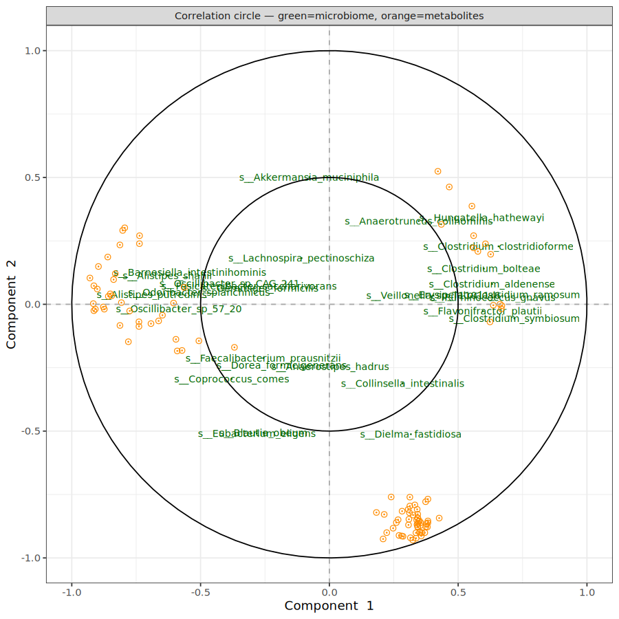
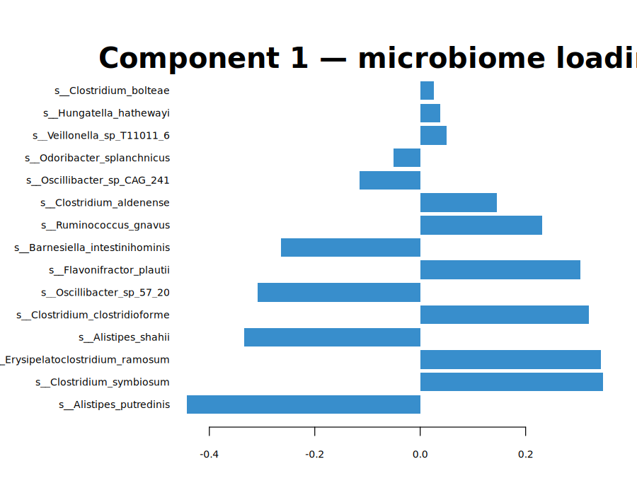
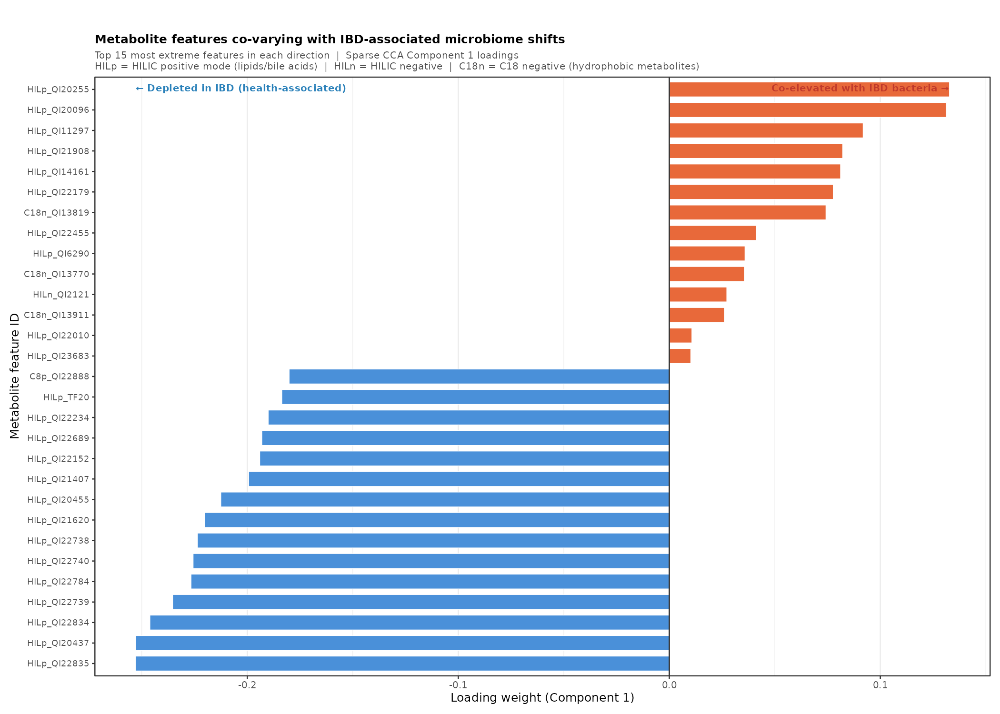
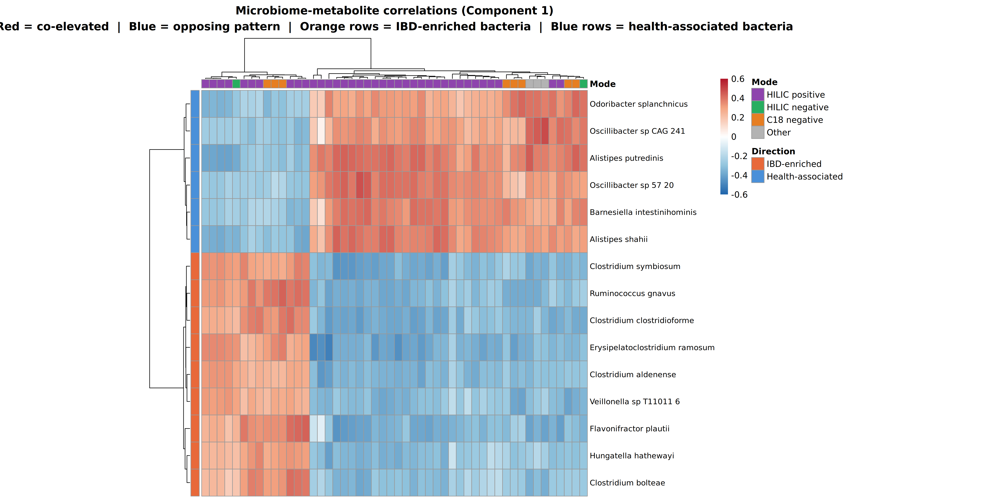

# HMP2 Multi-Omics Integration: Microbiome & Metabolomics in IBD

A bioinformatics portfolio project integrating gut microbiome and metabolomics data from IBD patients to identify disease-associated microbial and chemical signatures using MaAsLin2 and sparase Canonical Correlation Analysis (mixOmics). 

---

## Background

Inflammatory bowel disease (IBD), including Crohn's disease (CD) and ulcerative colitis (UC), is associated with profound disruption of both the gut microbiome and the gut chemical environment. This project asks: *"Which bacteria and metabolites change in IBD, and do those changes track together across patients?"*

To answer this, I used paired metagenomics and metabolomics data from the Human Microbiome Project Phase 2 (HMP2), one of the most comprehensive longitudinal multi-omics IBD datasets publicly available. 

---

## Dataset

**Source:** [IBDMDB — Inflammatory Bowel Disease Multi-omics Database](https://ibdmdb.org)

- **388 matched samples** with paired microbiome + metabolomics data
- **181 Crohn's disease / 102 ulcerative colitis / 105 healthy controls**
- Samples collected longitudinally across 5 hospital sites over ~1 year

---

## Methods 

- **Microbiome preprocessing** (`readr`, `dplyr`) - filtered to 122 species, CLR-transformed
- **Metabolomics preprocessing** (R + Python `biom-format`) - 66,717 features retained, log2-transformed
- **IBD association testing** (`MaAsLin2`) - species and metabolites tested individually against the diagnosis of the individual
- **Multi-omics integration** (`mixOmics` sparse CCA) - co-varying microbe-metabolite groups identified across patients
- **Visualization** (`ggplot2`, `ggrepel`, `pheatmap`) - 5 publication-style figures

## Key Findings

### MaAsLin2 - IBD-Associated Features
- **23 bacterial species** significantly associated with IBD diagnosis (q < 0.25)
- **559 metabolite features** significantly associated with IBD diagnosis (q < 0.25)
- Consistent depletion of short-chain fatty acid producers in IBD patients
- Consistent enrichment of pro-inflammatory *Clostridium* and *Flavonifractor* species

### Sparse CCA - Microbiome-Metabolite Co-variation
- **Component 1 microbiome-metabolome correlation: r = 0.733**
- **Component 2 microbiome-metabolome correlation: r = 0.617**
- Metabolomics separated IBD from healthy patients more cleanly than microbiome alone - consistent with findings in Lloyd-Price et al. (2019)
- IBD-enriched bacteria (*Flavonifractor plautii*, *Ruminococcus gnavus*, *Clostridium symbiosum*) co-vary with a distinct set of elevated metabolites
- Health-associated bacteria (*Alistipes putredinis*, *Alistipes shahii*, *Oscillibacter* spp.) co-vary with a separate set of depleted metabolites

---

## Figures

### Sample plot — Patient Separation by Diagnosis


### Correlation Circle — Microbiome-metabolite Co-variation


### Bacterial Species Driving IBD vs. Healthy Gut Distinction


### Metabolite Features co-varying with IBD Microbiome Shifts


### Microbiome-metabolite Correlation Heatmap


---

## Repository Structure

**`data/`**
- `raw/` - raw files downloaded from IBDMDB (gitignored)
- `processed/` - cleaned and normalized matrices (gitignored)

**`scripts/`**
- `01_download_data.sh` — downloads all raw data from IBDMDB
- `02_preprocess_microbiome.R` — CLR transformation, prevalence filter
- `03_preprocess_metabolomics.R` — log2 transform, missing data filter
- `04_run_maaslin2.R` — IBD association testing
- `05_run_mixomics.R` — sparse CCA integration
- `06_visualize.R` — publication-quality figures

**`results/`**
- `maaslin2/` — association result tables
- `mixomics/` — plots and loading tables

**`README.md`** — project overview and reproduction steps

**`WRITEUP.md`** — full methods, results, and biological interpretation

--- 

## How to Reproduce 

**Requirements:** R 4.3+, Python 3.x, WSL2 (Ubuntu) or any Linux environment

**1. Clone the repository**
```bash
git clone https://github.com/nlinares-GWU2026/hmp2-multiomics.git
cd hmp2-multiomics
```

**2. Download data**
```bash
bash scripts/01_download_data.sh
```

**3. Install R packages**
```r
install.packages("BiocManager")
BiocManager::install(c("Maaslin2", "mixOmics", "biomformat"))
install.packages(c("dplyr", "readr", "ggplot2", "ggrepel", "pheatmap"))
```

**4. Run the pipeline**
```bash
Rscript scripts/02_preprocess_microbiome.R
Rscript scripts/03_preprocess_metabolomics.R
Rscript scripts/04_run_maaslin2.R
Rscript scripts/05_run_mixomics.R
Rscript scripts/06_visualize.R
```

---

## References

Lloyd-Price, J., Arze, C., Bhatt, A.S. et al. (2019). Multi-omics of the gut
microbial ecosystem in inflammatory bowel diseases. *Nature*, 569, 655–662.

Mallick, H. et al. (2021). Multivariable association discovery in
population-scale meta-omics studies. *PLOS Computational Biology*, 17(11).

Rohart, F. et al. (2017). mixOmics: An R package for 'omics feature selection
and multiple data integration. *PLOS Computational Biology*, 13(11).

---

## Author

Nicole Linares | George Washington University
MS in Health Data Science - Milken Institute School of Public Health
GitHub: [@nlinares-GWU2026](https://github.com/nlinares-GWU2026)
